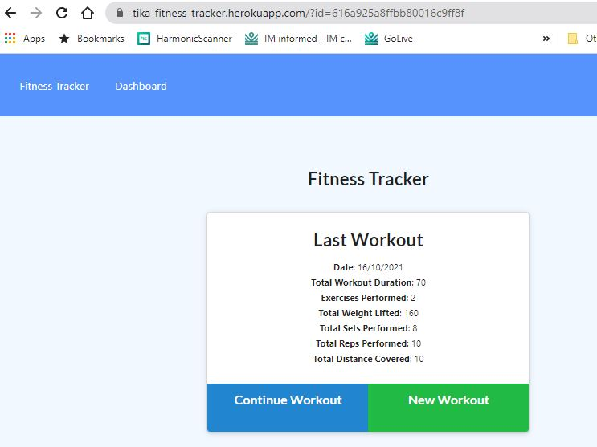
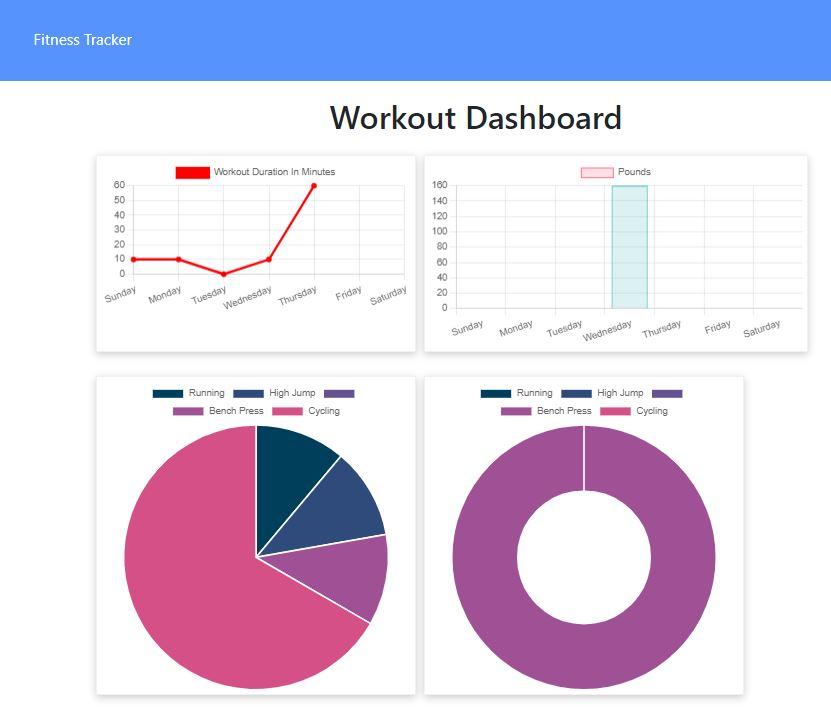
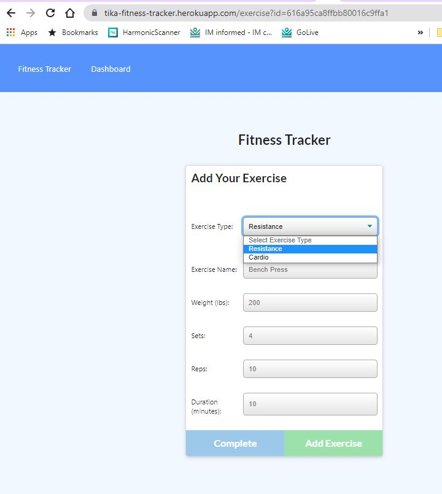

# Fitness Tracker
    This is simpal fitness tracker app built using Javascript, MongoDB, Mongoess, ExpressJS, HTML and CSS

# App UI
*Landing Page
    
*Dashboard
      
*New Workout Entry 
      

      

# User Story

    As a user, I want to be able to view create and track daily workouts. I want to be able to log multiple exercises in a workout on a given day. I should also be able to track the name, type, weight, sets, reps, and duration of exercise. If the exercise is a cardio exercise, I should be able to track my distance traveled.

# Business Context

    A consumer will reach their fitness goals more quickly when they track their workout progress.

# License
    This project is licensed under MIT License.

# Contribution
    Please let me know how I can improve this project. Issues and pull requests are always welcome.

# Questions
    e:tika.kandel.06@gmail.com